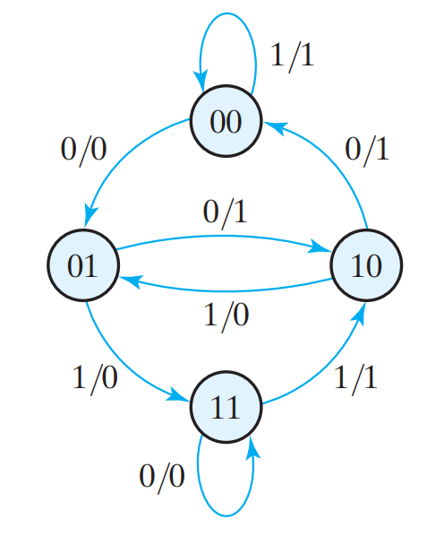
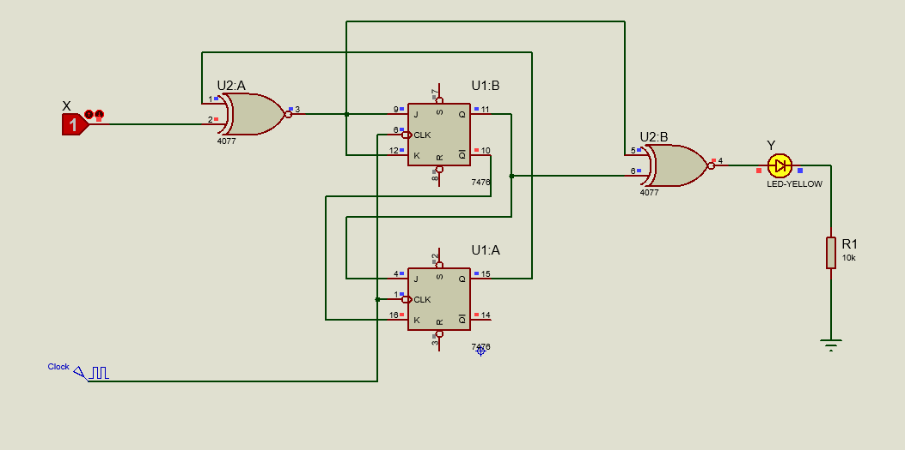

# StateDiagram Problem

## Question
 Design, construct, and test a sequential circuit whose state diagram is shown in Fig. 9.14 .
Designate the two flip‐flops as A and B, the input as x, and the output as y .
 Connect the output of the least significant flip‐flop B to the input x, and predict the
sequence of states and output that will occur with the application of clock pulses. Verify
the state transition and output by testing the circuit.  
### FIGURE 9.14

## Answer
State Table and Karnaugh maps in the **[Document file](Document.pdf)**.
The circuit are in the **[Proteus files](StateDiagram.pdsprj)**.

### Proteus circuit

