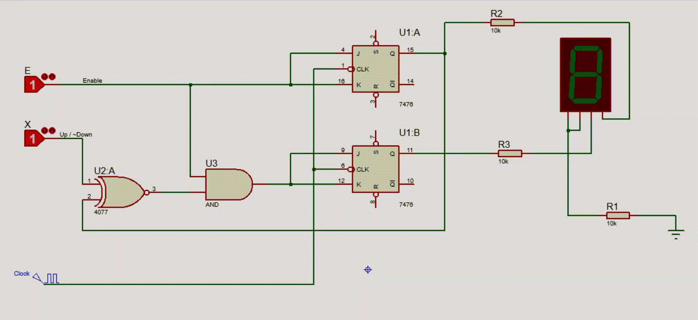

# UpDownCounter2Bit

## Question
 Design, construct, and test a two‐bit counter that counts up or down. An enable input E
determines whether the counter is on or off. If E = 0, the counter is disabled and remains
at its present count even though clock pulses are applied to the flip‐flops. If E = 1, the
counter is enabled and a second input, x, determines the direction of the count. If x = 1,
the circuit counts upward with the sequence 00, 01, 10, 11, and the count repeats. If x = 0,
the circuit counts downward with the sequence 11, 10, 01, 00, and the count repeats. Do
not use E to disable the clock. Design the sequential circuit with E and x as inputs. 

## Answer
State Diagram, State Table and Karnaugh maps in the **[Document file](Document.pdf)**.
The circuit are in the **[Proteus files](UpDownCounter.pdsprj)**.

### Proteus circuit

